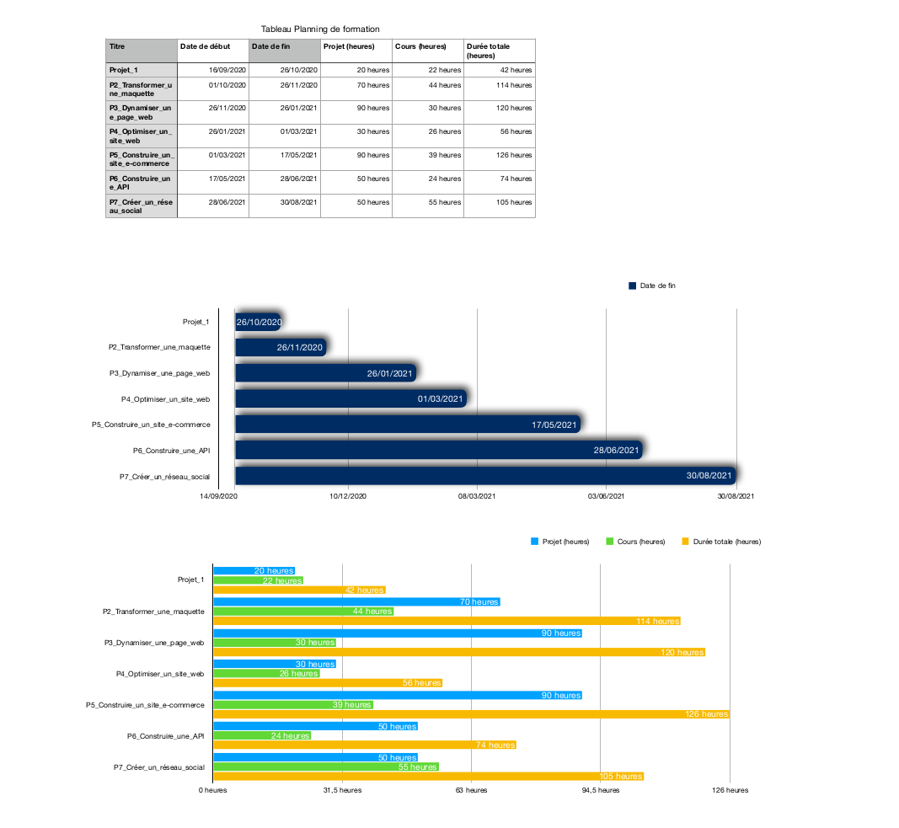

# Planning de formation

- J'ai dans l'idée de travailler un peu tous les soirs sur les cours et les projets. Ainsi que les week-end quand je suis là. Je me suis fixé environ 15h par semaine.

### Voici mon planning de formation (cela peut très bien changer en fonction de mes heures de disponibilité le soir)

