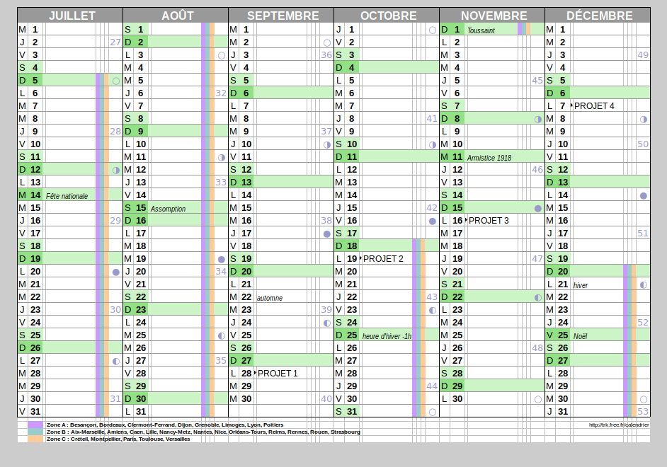
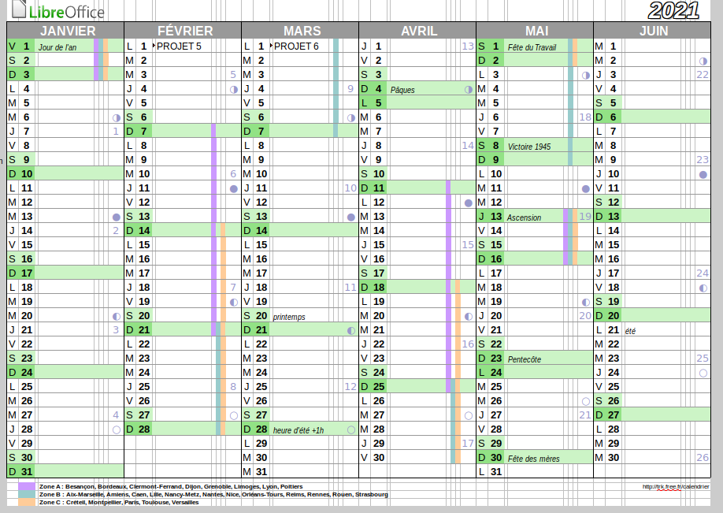
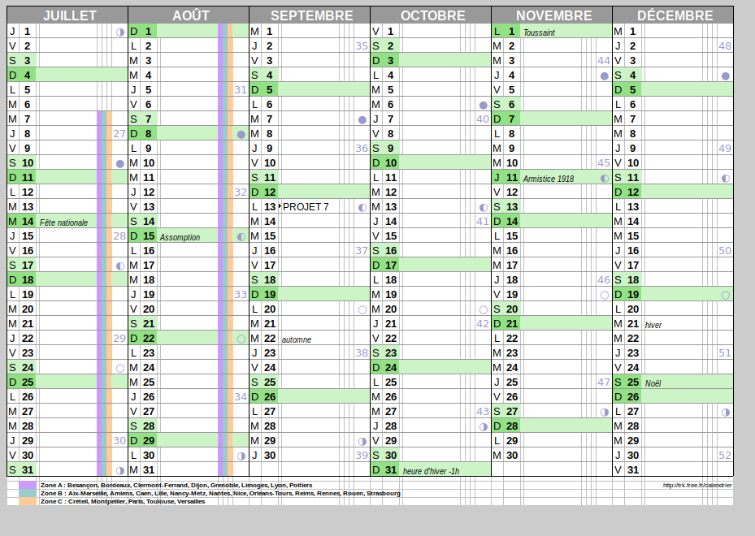

# Projet 1

## Planning de formation

- J'ai dans l'idée de travailler un peu tous les soirs sur les cours et les projets. Ainsi que les week-end quand je suis là.

### Voici les dates approximatives (cela peut très bien changer en fonction de mes heures de dispo le soir)

- Projet 1 : 28 Septembre 2020  
- Projet 2 : 19 Octobre 2020  
- Projet 3 : 16 Novembre 2020  
- Projet 4 : 7 Décembre 2020  
- Projet 5 : 1 Février 2021 
- Projet 6 : 1 Mars 2021  
- Projet 7 : 13 Septembre 2021

## Veille techno

- Pour ma veille technologique j'utilise pas mal Linkedin, en suivant des personnes dans le milieu du web, comme Lior Chamla par exemple. Sur Facebook je suis dans plusieurs groupe de développement web. Je ne connaissais pas Feedly et je vous en remercie car c'est très pratique !

## Offre d'emploi de mes rêves

Au sein de notre équipe tu concevras et développeras des sites web variés allant du simple site vitrine (pour se reposer un peu de temps en temps…) à la plate-forme sociale qui va révolutionner le monde, le tout en exerçant tes super pouvoirs de développeur. La variété des projets (de la start-up au grand compte…) te permettra de développer un maximum de connaissances et de progresser rapidement. 

Nos productions vont du site internet à l'outil dédié fullweb, extranet, etc.
- En phase de proposition commerciale, vous sourcez si nécessaire et validez les solutions techniques qui pourront être proposées par le commercial, évaluez les temps de développement et de déploiement,
- En phase de production, en collaboration avec le graphiste en charge du dossier, vous suivez le projet avec le client, développez et déployez les outils nécessaires, suivez les développements externes lorsqu'il y en a (applications iOS/Android reliées au site etc.) jusqu'à la mise en ligne du site,
- Pendant la vie du site, suivi de l'hébergement et suivi du référencement dans certains cas

Compétences : 

Vous maitrisez les langages : PHP, MySQL, BootStrap, JavaScript (Junior accepté),  Ajax et HTML/CSS3 Bootstrap (Junior accepté).

Vous aimez le travail bien fait, sourcer de nouvelles solutions, le code ne vous fait pas peur et pour vous, un client ne parle pas nécessairement une langue étrangère, on devrait s'entendre ! ;-)

En bonus… Des connaissances de React ou Vue.js seraient un plus.

Et bien sûr, des skills sur Python sont en option mais bienvenues !

Profil : 

    Avoir à cœur de coder proprement / respecter les bonnes pratiques
    Envie de travailler en équipe
    Travailler sur des projets de différents univers entièrement sur mesure

Vous êtes également créatif, innovant et proactif, alors n’hésitez plus rejoignez-nous ! Télétravail à 100% !

Présentation de l'entreprise :

70% de la production est digitale.
Le pôle développement est intégré depuis plus de 10 ans.

Notre expertise est reconnue, d'autres agences nous confiant le développement de sites internet, outils de communication, logiciels FullWeb.
Concernant le digital, nous traitons en interne le développement, l'intégration, le déploiement, le référencement, la gestion de l'hébergement sur des plateformes tierces.

L'agence a été retenue pour les Trophées de la Communication 2015 pour sa maîtrise des technologies OnePage et Adaptative/Responsive.

Date de début prévue : 19/09/2021

Type d'emploi : Temps plein, CDI ( remember : 100% en télétravail )

Salaire : 2 400,00€ à 3 300,00€ net par mois selon profil

Avantages :

Horaires : 2 jours de repos que vous préférez par semaine 
Rémunération supplémentaire : primes de fin d’année
